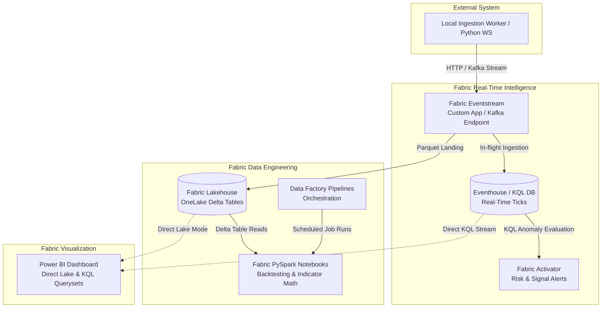
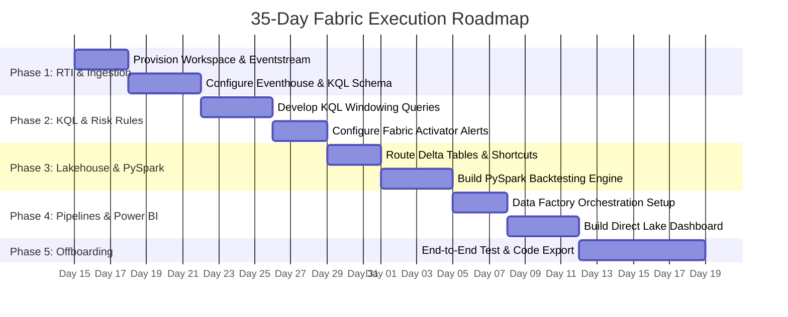

# Microsoft Fabric 35-Day Trial Execution Plan: Real-Time Algorithmic Trading Architecture

> **Objective:** Build and evaluate an enterprise-grade real-time trading analytics and risk management platform within a 35-day Microsoft Fabric trial window. This architecture mirrors the local Python/DuckDB engine by using Fabric Real-Time Intelligence (RTI), OneLake Delta tables, PySpark, and Direct Lake Power BI.

---

## 1. System Architecture & Flow

The streaming pipeline ingests real-time tick data using Fabric Eventstream, persists high-velocity events into an Eventhouse (KQL Database) for microsecond time-series queries, routes raw ticks to a Lakehouse Delta table for historical backtesting, and triggers real-time alerts via Fabric Activator.



---

## 2. Fabric Technology Stack & Decision Matrix

| Function | Fabric Artifact / Feature | Primary Selection Rationale |
| :--- | :--- | :--- |
| **Streaming Ingestion** | **Eventstream (RTI)** | Enterprise ingestion engine handling high-throughput JSON tick streams without managing Kafka broker infrastructure. |
| **Real-Time Storage** | **Eventhouse & KQL Database** | Columnar storage optimized for rapid time-series aggregations, rolling moving averages, and sub-second windowing queries. |
| **Historical Storage** | **Fabric Lakehouse (OneLake)** | Persists tick histories as Delta Lake tables (`.parquet`) for multi-year backtesting and open interoperability. |
| **Compute & Backtesting** | **PySpark Notebooks** | Scalable distributed compute environment for executing backtests, parameter sweeps, and machine learning routines across historical datasets. |
| **Alerts & Guardrails** | **Fabric Activator** | Event-driven trigger engine monitoring KQL streams to execute webhooks (Discord/Teams/REST API) on price spikes or stop-loss hits. |
| **Orchestration** | **Data Factory Pipelines** | Manages workflow schedules, automated backtesting loops, and Delta table maintenance routines. |
| **Visualization** | **Power BI (Direct Lake & KQL)** | Real-time reporting on portfolio P&L, system latency, and execution state with direct OneLake connectivity. |

---

## 3. Financial & Trial Resource Management

* **Trial Capacity Allocation:** All artifacts run within a 64-Capacity Unit (F64 equivalent) free trial workspace.
* **Capacity Unit (CU) Optimization:** Eventstream derived streams can be paused during non-market hours to conserve capacity units.
* **Estimated Production Cost (Post-Trial):** ~$0.36/CU-hour (Pay-As-You-Go F2 capacity (~$260/month) or F4 (~$520/month) depending on tick volume).

---

## 4. Workspace & Repository Structure

```text
TradingBot_Fabric_Workspace/
├── Eventstreams/
│   └── es_market_ticks            # Main ingestion endpoint for tick streams
├── Eventhouses/
│   └── eh_trading_data            # Eventhouse container
│       └── db_realtime_ticks      # KQL Database for sub-second queries
├── Lakehouses/
│   └── lh_market_history          # OneLake Delta Lake storage
│       ├── Tables/
│       │   ├── ticks_delta        # Historical raw tick data
│       │   └── minute_candles     # Aggregated 1-minute candle bars
├── Notebooks/
│   ├── nb_pyspark_backtest.ipynb  # Strategy backtester & parameter optimizer
│   └── nb_indicator_engine.ipynb  # Daily technical indicator generator
├── DataPipelines/
│   └── pl_daily_maintenance       # Pipeline for table compaction & maintenance
├── Activators/
│   └── act_risk_monitor           # Real-time alert triggers
└── Dashboards/
    └── rtd_portfolio_monitor      # Real-time KQL & Direct Lake Power BI report
```

---

## 5. 35-Day Implementation Roadmap



### Milestone Breakdown

#### Phase 1: Ingestion & Real-Time Intelligence (Days 1–7)
* Provision a Fabric Capacity workspace under the 35-day trial.
* Create `es_market_ticks` Eventstream item with a **Custom App** endpoint.
* Create `eh_trading_data` Eventhouse and establish the `StockTicks` KQL table.
* Modify the local Python producer script to stream WebSocket payloads directly into the Fabric Eventstream HTTP endpoint.

#### Phase 2: KQL Analytics & Activator Rules (Days 8–14)
* Write KQL queries for real-time technical indicators (VWAP, Exponential Moving Averages, RSI):
  ```kusto
  // 5-minute rolling VWAP in KQL
  StockTicks
  | where Timestamp > ago(1h)
  | summarize 
      VolumeWeightedPrice = sum(Price * Volume) / sum(Volume),
      High = max(Price),
      Low = min(Price),
      Close = arg_max(Timestamp, Price)
    by Symbol, bin(Timestamp, 5m)
  ```
* Connect **Fabric Activator** to monitor the KQL stream and trigger Webhook calls when prices break daily support/resistance bounds.

#### Phase 3: Lakehouse & PySpark Engine (Days 15–21)
* Add a **Lakehouse Destination** to `es_market_ticks` to auto-persist incoming streams as Delta Lake tables in OneLake.
* Open a PySpark Notebook (`nb_pyspark_backtest.ipynb`) to read Delta tables, execute historical backtests, and store backtest metric results:
  ```python
  from pyspark.sql import functions as F

  df_ticks = spark.read.table("lh_market_history.ticks_delta")
  df_candles = df_ticks.groupBy("symbol", F.window("timestamp", "1 minute")).agg(
      F.first("price").alias("open"),
      F.max("price").alias("high"),
      F.min("price").alias("low"),
      F.last("price").alias("close"),
      F.sum("volume").alias("volume")
  )
  df_candles.write.format("delta").mode("append").saveAsTable("lh_market_history.minute_candles")
  ```

#### Phase 4: Pipelines & Real-Time Visualization (Days 22–28)
* Build a **Data Factory Pipeline** to schedule notebook execution and run table OPTIMIZE/VACUUM commands.
* Build a **Real-Time Dashboard** connected directly to the KQL Database for microsecond streaming chart refreshes.

#### Phase 5: Verification & Offboarding (Days 29–35)
* Benchmark query latency and cost efficiency between the local DuckDB engine and Fabric Eventhouse.
* Export all PySpark notebooks (`.ipynb`), KQL query files (`.kql`), and Power BI templates (`.pbit`) to Git prior to trial expiration.

---

## 6. Key Risks & Mitigation Controls

1. **Trial Expiration & Data Loss:**
   * *Risk:* Access to the Fabric workspace terminates on Day 35.
   * *Mitigation:* Ensure OneLake Delta tables are exported or synchronized to an external Azure Data Lake Storage Gen2 (ADLS Gen2) account or local storage before the trial ends.
2. **KQL Concurrency & Rate Limits:**
   * *Risk:* Frequent streaming writes lock table schemas.
   * *Mitigation:* Use Eventstream's built-in ingestion buffering to batch raw events before landing them in the KQL table.
3. **Data Parity Verification:**
   * *Risk:* Ingestion discrepancies between the local DuckDB worker and Fabric Eventstream.
   * *Mitigation:* Run daily checksum queries comparing record counts between DuckDB (`SELECT count(*) FROM ticks`) and KQL (`StockTicks | count`).