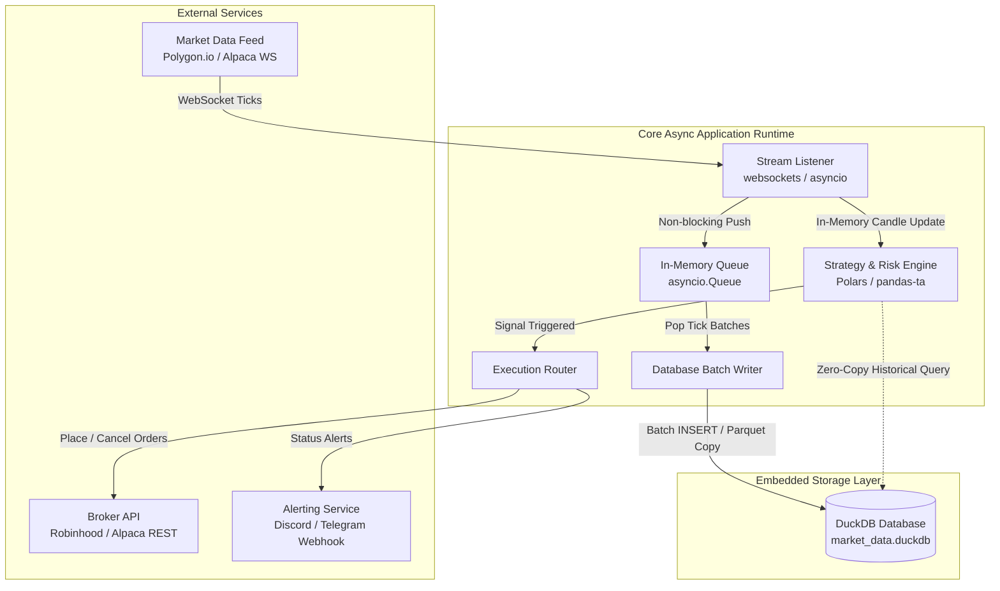
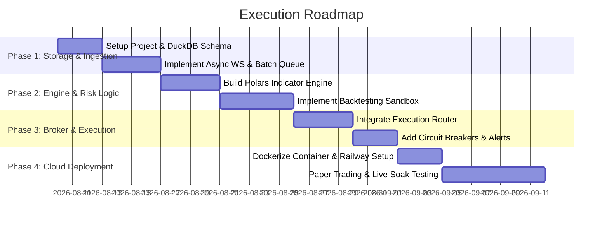

# Algorithmic Trading Bot & Real-Time Analytics Pipeline

> **Project Scope:** High-concurrency streaming market data engine with embedded DuckDB persistence, technical indicator computation, automated order execution, and continuous monitoring.

---

## 1. System Architecture & Component Flow

The system operates as an asynchronous event-driven application. Incoming WebSocket frames from the market data provider are processed in-memory for instant strategy evaluation, while an asynchronous task periodically flushes batched ticks into DuckDB to minimize disk I/O.

### Overall Data Architecture Diagram



---

## 2. Technology Stack & Decision Matrix

Each element in this stack was selected to maximize single-developer efficiency, minimize operational overhead, and maintain high performance without recurring cloud infrastructure costs.

| Layer | Component | Selection | Primary Rationale & Justification |
| :--- | :--- | :--- | :--- |
| **Language** | Core Runtime | **Python 3.11+ (`asyncio`)** | Provides native asynchronous concurrency for high-throughput I/O (WebSockets, DB flushes, HTTP requests) without the complexity of multi-threading locks. |
| **Persistence** | Embedded Database | **DuckDB** | In-process columnar OLAP database. Offers microsecond local query speeds, native zero-copy integration with Arrow/Polars, zero server maintenance, and simple single-file deployment (`.duckdb`). |
| **Data Processing** | Analytics & TA | **Polars + pandas-ta** | Polars delivers Rust-backed multi-threaded execution for sliding-window calculation. Integrates natively with DuckDB queries via Apache Arrow without memory copying. |
| **Market Data** | WebSocket API | **Polygon.io / Alpaca** | Provides dedicated low-latency WebSocket streaming endpoints for real-time US equity/crypto tick data and minute bars. |
| **Brokerage** | Order Routing | **`robin_stocks` / Alpaca SDK** | Handles REST API authentication, order creation (market, limit, stop-loss), and portfolio balance queries. |
| **Hosting** | PaaS Deployment | **Railway / Render** | Containerized hosting with zero infrastructure provisioning. Manages continuous background Python worker processes, environment secrets, and persistent disk mounts. |
| **Monitoring** | Alerting | **Discord Webhooks** | Lightweight, zero-cost notification delivery for real-time order execution logs, daily P&L summaries, and runtime error alerts. |

---

## 3. Financial & Operational Cost Breakdown

| Category | Option / Tool | Estimated Monthly Cost | Notes / Considerations |
| :--- | :--- | :--- | :--- |
| **Market Data** | Polygon.io / Alpaca SIP | **$0 – $199 / mo** | Free tiers available for delayed/basic feeds; ~$29–$199/mo for real-time WebSockets with full US coverage. |
| **Cloud Hosting** | Railway / Render (PaaS) | **$5 – $15 / mo** | Pay-as-you-go micro containers running 24/7 background worker processes. |
| **Database** | DuckDB | **$0 / mo** | In-process single-file database embedded directly in your runtime. |
| **Brokerage Fees** | Robinhood / Alpaca | **$0 / trade** | Zero-commission equity trades (watch out for bid-ask spread slippage). |
| **Total Estimated Run Cost** | | **$5 – $214 / mo** | Scales based on the real-time market data requirements. |

---

## 4. Project Repository Structure

```text
trading-bot/
├── config/
│   ├── settings.py         # API keys, symbols, and strategy parameters
│   └── secrets.env         # Environment variables (Git-ignored)
├── engine/
│   ├── stream_listener.py  # WebSocket connection manager
│   ├── strategy.py         # Signal logic & indicator math via Polars/DuckDB
│   ├── execution.py        # Order placement (robin_stocks / Alpaca)
│   └── db_manager.py       # Async DuckDB batch writes & maintenance
├── storage/
│   └── market_data.duckdb  # Persistent DuckDB storage file
├── Dockerfile              # Container spec for cloud deployment
├── requirements.txt        # Python dependency manifest
└── main.py                 # Async entry point initializing the event loop
```

---

## 5. Implementation Plan & Milestones



### Phase 1: Storage & Async Ingestion (Days 1–7)
* Setup project environment, `requirements.txt`, and configuration loaders.
* Initialize local `DuckDB` schema for `ticks`, `minute_candles`, and `execution_logs`.
* Build asynchronous `stream_listener.py` using `asyncio` and `websockets`.
* Implement the background batch writer using `asyncio.Queue` to flush ticks every 1 second.

### Phase 2: Analytics & Backtesting (Days 8–16)
* Write query utility functions to pull historical tick data directly from DuckDB into `Polars` DataFrames.
* Build signal logic in `strategy.py` using `pandas-ta` indicators (e.g., RSI, Exponential Moving Averages, VWAP).
* Run historical backtests on stored local DuckDB data to refine strategy parameters and slippage assumptions.

### Phase 3: Order Routing & Safety Controls (Days 17–23)
* Construct `execution.py` to handle authentication and order submission with the target broker API.
* Implement strict risk rules: maximum position size limits, hard daily stop-loss triggers, and order retry logic.
* Connect Discord/Telegram webhooks for push notifications on trade actions.

### Phase 4: Containerization & Deployment (Days 24–33)
* Write a multi-stage `Dockerfile` optimizing for Python 3.11 and DuckDB C extensions.
* Provision a background worker on **Railway** (or **Render**) with a persistent volume attached for the DuckDB storage file.
* Run a 7-day soak test in **Paper Trading Mode** to verify WebSocket reconnect behavior, data consistency, and memory usage under long-term operation.

---

## 6. Key Risks & Mitigation Controls

1. **Process Crash State Recovery:**
   * *Risk:* Server restart causes temporary loss of in-memory sliding window candles.
   * *Mitigation:* On boot, the strategy engine runs a startup query against DuckDB (`SELECT * FROM minute_candles ORDER BY timestamp DESC LIMIT 200`) to rehydrate state instantly.
2. **Database Concurrency Locks:**
   * *Risk:* Concurrent reads (analytics/dashboard) lock out the async background writer.
   * *Mitigation:* Configure DuckDB write operations within single-thread queues, and force external visualization connections to open DuckDB in `read_only=True` mode.
3. **API Rate Limits & Disconnections:**
   * *Risk:* Broker API throttling or silent WebSocket drops.
   * *Mitigation:* Wrap all API calls with exponential backoff retries and implement ping/pong heartbeats to force WebSocket reconnects when connections stall.